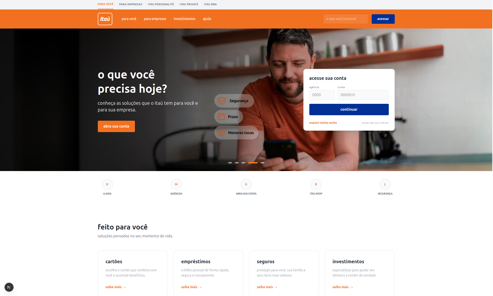

## ⚠️ Aviso Legal (Disclaimer)

Este projeto foi desenvolvido estritamente para **fins educacionais e de portfólio**. Ele consiste em um clone visual e estrutural da landing page do Itaú Unibanco para demonstrar habilidades avançadas em desenvolvimento web (Next.js 16, TypeScript e Tailwind CSS v4).

**Não possui vínculo com o Itaú Unibanco S.A.** e **não deve ser utilizado para fins maliciosos**, phishing ou qualquer tentativa de fraude. Este é um ambiente de estudo focado em UI/UX e arquitetura de componentes.

# Project Itaú | High-Fidelity Landing Page 🏦




Replicação fiel da interface do portal Itaú, utilizando os padrões mais recentes do mercado React. O projeto foca em um layout minimalista, responsividade total e suporte nativo ao modo escuro (`dark:` mode).

## 🚀 Funcionalidades e Diferenciais

- **Dynamic Banner System:** Slider com transição de opacidade suave e overlay de gradiente para legibilidade.
- **LoginBox Integrado:** Área de acesso à conta com validação visual e glassmorphism.
- **Arquitetura de Segmentos:** Divisão clara entre o varejo e seções premium (Personnalité).
- **Fat Footer Corporativo:** Rodapé denso com diretório de links, redes sociais e informações regulatórias.
- **Dark Mode Nativo:** Estilização baseada em tokens de cor que se adaptam ao sistema do usuário.

## 📂 Estrutura Detalhada do Projeto

```text
├── src/
│   ├── app/
│   │   ├── globals.css                 # Configurações de tema, variáveis @theme e Tailwind v4
│   │   ├── layout.tsx                  # Root Layout com SegmentBar e metadados
│   │   └── page.tsx                    # Composição da Landing Page (Hero, Grid, Benefícios)
│   ├── components/                     # Componentes isolados com lógica e UI
│   │   ├── AppSection.tsx              # Seção de conversão para download do App com QR Code
│   │   ├── BenefitsSection.tsx         # Grid de vantagens (iPhone pra sempre, Itaú Shop)
│   │   ├── DynamicBanner.tsx           # Container dinâmico para background slides (AVIF)
│   │   ├── HeroBanner.tsx              # Componente de texto e CTA principal do Hero
│   │   ├── LoginBox.tsx                # Formulário de acesso à agência e conta
│   │   ├── QuickLinks.tsx              # Atalhos rápidos iconográficos abaixo do banner
│   │   ├── SecurityBanner.tsx          # Seção institucional de segurança em Azul Itaú
│   │   ├── SegmentsHighlight.tsx       # Destaque para Personnalité e Empresas (Layout Escuro)
│   │   ├── ServicesGrid.tsx            # Grade de produtos (Cartões, Empréstimos, Investimentos)
│   │   └── HelpSection.tsx             # Central de ajuda com botões de contato
│   ├── layouts/                        # Estruturas fixas de navegação
│   │   ├── Header.tsx                  # Cabeçalho institucional com busca e acesso
│   │   └── Footer.tsx                  # Rodapé completo (Links, Social e Legal)
│   ├── types/
│   │   └── itau.ts                     # Definições de interfaces TypeScript (D.T.O)
│   └── proxy.ts                        # Gerenciamento de roteamento seguro (Substituto Middleware)
├── public/
│   └── banners/                        # Arquivos 1.avif até 5.avif do slider principal
├── postcss.config.mjs                  # Configurações de pós-processamento v4
├── tsconfig.json                       # Configurações rigorosas do compilador
└── package.json                        # Scripts e dependências (@react-icons/all-files)

```

## 🛠️ Explicação Técnica das Estruturas

* **`src/app/globals.css`**: Define a paleta institucional usando `@theme` do Tailwind v4 (Itaú Orange: `#EC7000`, Itaú Blue: `#003399`).
* **`src/proxy.ts`**: Implementa a camada de proxying necessária na versão Next 16+, garantindo que o fluxo de dados das APIs internas seja protegido.
* **`src/components/DynamicBanner.tsx`**: Utiliza `useEffect` para controle de tempo e transições CSS puras para alternar entre os banners `.avif`.
* **`src/layouts/Footer.tsx`**: Estrutura densa dividida em três níveis: Diretório de links (Fat-Footer), Barra Social/App e Base Legal Azul.

## ⚙️ Instalação e Execução

1. **Clonagem do repositório:**
```bash
git clone git@github.com-pessoal:LeonardoFirme/project-itau.git

```

2. **Instalação das dependências:**
```bash
npm install

```

3. **Instalaçãao do pacote de icones:**
```bash
npm install @react-icons/all-files --save

```

4. **Desenvolvimento:**
```bash
npm run dev

```

5. **Produção:**
```bash
npm run build && npm run start

```

---

*Desenvolvido por [Leonardo Firme](https://github.com/LeonardoFirme).*